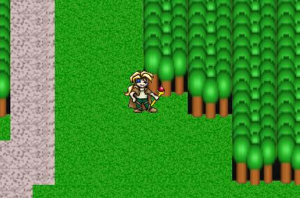



## A actual RPG in Progress, Space Quest

### Description

Space Quest is the temporary name for the single player RPG (in progress) that currently P4R14H(art) and I(programming) are working on.

It has nothing to do with space travel or anything (more Lord of the Rings-ish), just read the readme.txt in the zip.

It uses DirectX7 and it needs a computer that supports 1024x768 24-bit screen mode.

Its got collision detection and map loading and map scrolling. Map editing is still in progress.

It also limits frame rates to 30 fps, so it will never run too fast, only too slow.

Feel free to borrow from the code if u like it, just e-mail me about it first.

(This game is in the making so expect this entry to be updated with any major changes).

note:(if ur computer doesn't support 24bit colour, only 32bit then change the code in the init method to say 32 instead of 24)
 
### More Info
 

             |
---                |---
**Submitted On**   |2001-01-23 21:40:28
**By**             |[Roger the Camel](https://github.com/Planet-Source-Code/PSCIndex/blob/master/ByAuthor/roger-the-camel.md)
**Level**          |Intermediate
**User Rating**    |4.1 (70 globes from 17 users)
**Compatibility**  |VB 6\.0
**Category**       |[DirectX](https://github.com/Planet-Source-Code/PSCIndex/blob/master/ByCategory/directx__1-44.md)
**World**          |[Visual Basic](https://github.com/Planet-Source-Code/PSCIndex/blob/master/ByWorld/visual-basic.md)
**Archive File**   |[CODE\_UPLOAD140811232001\.zip](https://github.com/Planet-Source-Code/roger-the-camel-a-actual-rpg-in-progress-space-quest__1-14644/archive/master.zip)

